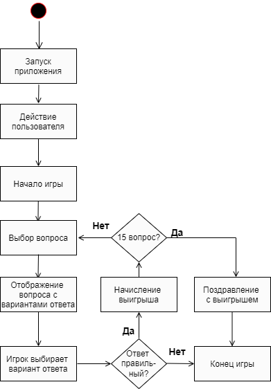

# Игра "кто хочет стать миллионером"

## Правила игры
Игрок для того, чтобы заработать 3 миллиона рублей, должен правильно ответить на 15 вопросов из различных областей знаний. Каждый вопрос имеет 4 варианта ответа, из которых только один является верным. Каждый вопрос имеет конкретную стоимость. Все суммы являются заменяемыми, то есть после ответа на следующий вопрос не суммируются с суммой за ответ на предыдущий.

## Пример игры

## Архитектура

Проект разработан на C++. Вопросы создаются заранее и выбираются случайным образом во время игры.

## Текущие процессы на проекте

